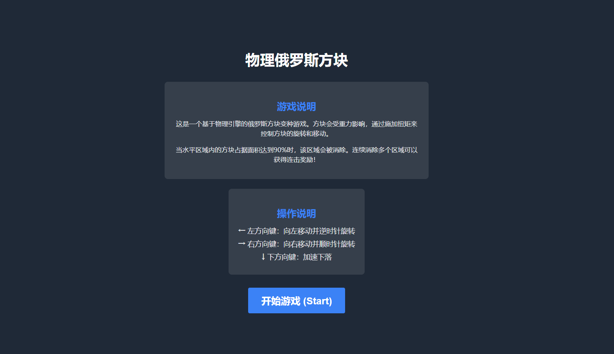
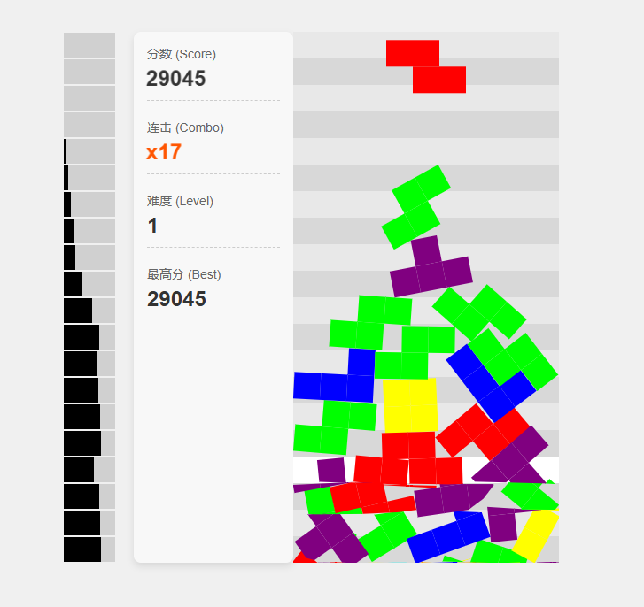

# 物理俄罗斯方块 (Matter.js)

一个基于 Matter.js 构建的 2D 物理俄罗斯方块变种游戏。本项目旨在探索在经典方块堆叠游戏中融合真实的物理模拟。

## 在线体验

🎮 [立即体验](https://not-tetris-2-ten.vercel.app/)

## 游戏截图

## 核心特性

* **物理引擎:** 使用 Matter.js 实现真实的物理模拟
* **创新控制:** 通过左右方向键施加扭矩控制方块旋转
* **物理堆叠:** 方块遵循物理定律进行堆叠和稳定
* **智能消除:** 基于区域面积占比的消除机制
* **连击系统:** 支持多区域同时消除的连击奖励

## 操作说明

* **左方向键:** 施加逆时针扭矩
* **右方向键:** 施加顺时针扭矩

## 技术栈

* [Matter.js](https://brm.io/matter-js/) - 2D 物理引擎
* HTML5 Canvas - 游戏渲染
* JavaScript - 游戏逻辑

## 本地运行

1. 克隆仓库
2. 在浏览器中打开 `index.html`

## 开发计划

* 环境干扰系统
* 物理碎片效果
* 流体模式 